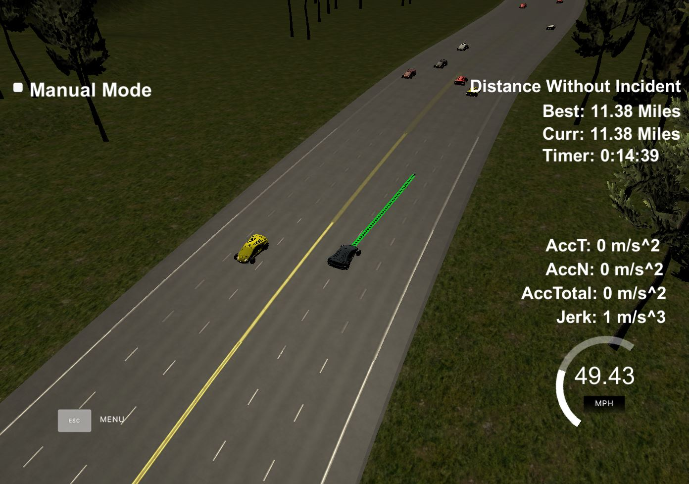

# Path Planning Project

## Reflection

Here is how I developed this project：

- First, I tried to let the the car move forward without lane change. It is convenient to implement this in frenet(just maintain the d value). Coordinate transform is also applied. But the routine is not smooth and the acceleration and jerk is too large. 
- Then I use points in large intervel(30m) and use spline get smooth path curve, I get the path point from the curve according to a reference velocity. The reference velocity is changed in small step(0.224 mph per step) gradually, so the acceleration won't be too large. When the speed is smaller than 49.5 mph, the reference velocity increase. When the car is very closed to the car ahead,  the reference velocity decrease.
- Then I added the lane change part.  The car start to find a lane to change when the distance between the car and the front car. It tends to choose the middle lane(just by setting different paraments), and it will choose the lane with longest free length between left lane and right lane.  The possible lane change is valid when there is enough space between the car in target lane and the car changing lane
- I did not let the car slow down and wait some time to change lane, so it may be awkward when the car is at the two side lane and is blocked by the middle car.

## Result

Here is an sample result.

